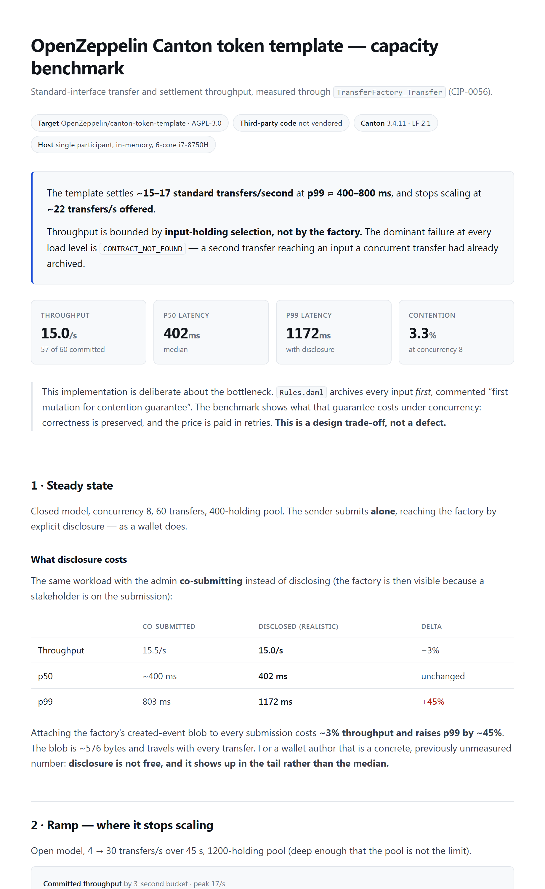

# canton-stress

A **load / performance / stress-testing harness for Canton applications**.
Point it at a DAR, drive concurrent multi-party transactions at a real ledger,
and measure throughput, latency percentiles, and contention.

**Status: complete and validated live.** Declarative workloads,
coordinated-omission-correct measurement, HTML reports + sweeps + CI gates, a
setup program that drives a *real* factory-shaped app into a loadable state,
Canton-specific instrumentation (hot-contract attribution, per-party latency,
read-side lag, CIP-0104 traffic cost), ramp/soak/spike/stress test modes, and
distributed load generation across worker processes.

## What it produces

A self-contained HTML report per run. This one benchmarks
[OpenZeppelin's Canton token template](https://github.com/OpenZeppelin/canton-token-template)
— third-party CIP-0056 code we did not write — through the standard
`TransferFactory_Transfer` interface choice:

[](examples/openzeppelin/benchmark-report.html)

<sub>Open [`examples/openzeppelin/benchmark-report.html`](examples/openzeppelin/benchmark-report.html)
in a browser for the full report, or read it as markdown in
[`examples/openzeppelin/BENCHMARK.md`](examples/openzeppelin/BENCHMARK.md).</sub>

**The headline result:** the template settles ~15–17 transfers/second and stops
scaling at ~22/s offered — but throughput is bounded by **input-holding
selection, not by the factory contract** every transfer routes through. The
factory is referenced by every transfer and consumed by none, so it never
conflicts. Along the way the report puts a number on explicit disclosure:
**~3% throughput, and p99 up 45%**, for a ~576-byte blob on every submission.

That is a design trade-off in correct code, not a defect — and it is the kind of
answer that only appears under concurrent load.

---

- **[examples/token-standard/BENCHMARK.md](examples/token-standard/BENCHMARK.md)**
  — a benchmark of a **real Canton Network Token Standard (CIP-0056) registry**,
  measured through the standard `TransferFactory_Transfer` interface choice.
  Read this first if you want to know what the tool actually produces.
- **[METHODOLOGY.md](METHODOLOGY.md)** — **how to load-test a Canton app**: load
  models, the traps, how to read the numbers, a worked run. Start here if you
  care about the method rather than the tool.
- **[examples/openzeppelin/BENCHMARK.md](examples/openzeppelin/BENCHMARK.md)** —
  the same benchmark against **third-party** code: OpenZeppelin's Canton token
  template, including the disclosure cost and the measurement trap.
- **[TESTING-GUIDE.md](TESTING-GUIDE.md)** — how to run it, and how to triage a
  failing run.
- **[CHANGELOG.md](CHANGELOG.md)** — what changed per version, and each milestone's known limits.
- **[WORKLOAD-FORMAT.md](WORKLOAD-FORMAT.md)** — the workload/setup file format.
- **[DESIGN.md](DESIGN.md)** — what it is, complexity, phases, methodology,
  Canton-specific challenges, target projects, interface (CLI + report).

## It works today

`src/` is a standalone, dependency-free TypeScript tool (Node ≥ 23.6) reusing
the proven ledger client + sandbox manager from `../tool`.

```
# quick smoke: raw write throughput + latency (boots a sandbox from cold):
node src/cli.ts run <dar> --template "#pkg-name:Module:Entity" \
  --workload create --parties 3 --ops 100 --concurrency 16 \
  --sandbox --java-home <openjdk> --report out.json

# a REAL app: a declarative workload whose setup program opens accounts through
# a factory and credits holdings before anything is measured:
node src/cli.ts run examples/settlement-app/.daml/dist/canton-stress-settlement-0.1.0.dar \
  --workload-file examples/settlement-app/workload.json \
  --model closed --concurrency 8 --ops 60 --sandbox --java-home <openjdk>

# find the cliff, then gate CI on it:
node src/cli.ts run <dar> ... --model open --sweep 4,8,16 --report sweep.json
node src/cli.ts report sweep.json --out sweep.html
node src/cli.ts run <dar> ... --max-p99 2000 --min-throughput 10   # non-zero exit on breach

# Canton instrumentation: name the bottleneck, and gate on it:
node src/cli.ts run <dar> ... --lag-sample 250 --max-hotspot-share 50

# drive load from several processes, optionally across several participants:
node src/cli.ts run <dar> ... --workers 4 --api http://p1:7575,http://p2:7575
```

**Live results** (local sandbox):

- *create* — 100 ops @ concurrency 16: 100 committed, **8.3 tx/s**, latency
  **p50 627 ms / p99 8.6 s** (the p50↔p99 gap is exactly the tail-latency signal
  a perf tool surfaces).
- *open model* — target 15/s, achieved **4.2/s** with p99 ~10 s: the backlog a
  naive tool hides is charged as real tail latency (coordinated omission).
- *settlement app* — a 32-command setup chain builds accounts + holdings, then
  60 measured settlements: **8.1/s at 55% contention** with a 24-holding pool,
  **18.8/s at 21.7%** with 120. The scaling limit is pool depth — the kind of
  answer the tool exists to give.
- *hot-contract attribution* — a workload funnelling through one shared
  `Registry` contract reported **46.7% contention overall**, which decomposed
  into healthy settlements at 8.8% and the registry losing **96.2%** of its
  races, **89.3% of all contention on that one contract**. Naming the contract
  is the difference between "it's slow" and "here is the line to change".

## What makes it Canton-specific

A generic load tool (k6, JMeter, Gatling) reports latency and error rates. It
has no notion of the three things that decide whether a Canton app scales, all
of which this reports:

- **Which contract is serializing you** — contention attributed per contract,
  plus a concentration figure that separates *one bottleneck* from *broad,
  structural contention*. There is a CI gate for it
  (`--max-hotspot-share`) that fires where a plain contention budget passes.
- **Whose latency it is** — per-party and per-operation breakdowns, because
  each party sees its own projection and a global percentile hides that.
- **What it costs** — CIP-0104 traffic estimation per operation and per second,
  taken out-of-band so it cannot perturb the run. Honest caveat: a sandbox has
  no traffic control, so it reports **UNMETERED** rather than a fake zero; real
  figures need a traffic-metered synchronizer.

## Gating CI, and getting results into your dashboards

A load test that only prints to a terminal is read once. Two ways to make the
numbers stick:

**Any CI, via the exit code.** The integration contract is three lines and no
platform: `0` = within SLA, `1` = breached, `2` = refused to run. GitLab,
Jenkins and plain-shell examples are in [`ci/README.md`](ci/README.md).

```
node src/cli.ts run <dar> --workload-file <w.json> --max-p99 2000 --report run.json
echo $?
```

**Optionally, a GitHub Action** for teams already on it — convenience, not a
dependency:

```yaml
- uses: <owner>/canton-stress@v1
  with:
    dar: .daml/dist/my-app-1.0.0.dar
    workload: perf/transfer.json
    max-p99-ms: "2000"
    max-hotspot-share-pct: "50"
    baseline: perf/baseline.json      # optional regression gate
```

It renders the HTML report and uploads it as an artifact **even when the gate
fails** — that is the run somebody actually needs to read.

**Prometheus export** — put capacity next to the graphs a team already watches:

```
node src/cli.ts run <dar> ... --prometheus metrics.prom --metric-label app=settlement
```

```
canton_stress_throughput_per_second{app="settlement",model="closed"} 11.15
canton_stress_latency_seconds{app="settlement",quantile="0.99"} 0.879
canton_stress_operations_total{app="settlement",outcome="contention"} 19
canton_stress_contention_concentration{app="settlement"} 0.34
```

Latency is exported in **seconds** (Prometheus' base unit), and contention is
labelled **per operation kind, never per contract id** — unbounded label
cardinality is how monitoring systems get taken down.

## Safety — the part a load tool cannot get wrong

Every other module here tries to generate as much load as it can. This one is
the counterweight: a load generator is the one test tool that can *cause* the
incident it was meant to prevent.

```
# see exactly what would happen — submits nothing, boots nothing
node src/cli.ts run <dar> --workload-file <w.json> --mode ramp --to 60 --duration 90 --dry-run

  target:     http://localhost:7575  (local sandbox, booted by this run)
  workload:   file:settlement.json — 6 parties + roles [custodian, issuer]
  setup:      32 command(s) before measuring
  arrivals:   5/s → 60/s (peak 60/s)
  extent:     90s
  ESTIMATED TOTAL COMMANDS SUBMITTED: ~2957
```

- **Remote targets are opt-in.** Anything not on this machine — including
  private LAN addresses — is refused unless you pass `--allow-remote`, and even
  then the plan and target are printed before the first command goes out.
- **Caps are on by default**: 1000 ops/s, 1,000,000 operations, 1 hour. They
  exist to catch a mistyped `--rate 5000`, not to get in the way, and every
  refusal names the exact flag that lifts it. A ramp is checked against its
  **peak**, not its starting rate.
- **Checks run before anything is submitted**, and before a sandbox is booted,
  so a mistake costs nothing.

## Test modes — capacity planning *is* these four

A single steady run is one data point, not a test. Each mode varies the offered
load over time and answers one question:

```
node src/cli.ts run <dar> ... --model open --mode ramp   --from 10 --to 200 --duration 60
node src/cli.ts run <dar> ... --model open --mode spike  --from 20 --to 150 --duration 60
node src/cli.ts run <dar> ... --model open --mode soak   --rate 25 --duration 900
node src/cli.ts run <dar> ... --model open --mode stress --rate 60 --duration 60
```

| mode | question | verdict |
|---|---|---|
| **ramp** | where does it bend? | latency knee + throughput cliff |
| **soak** | is it the same system an hour later? | drift in p99 and throughput |
| **spike** | does it survive a burst? | recovery time back to baseline |
| **stress** | where does it break, and how? | breaking point + dominant failure |

Measured live against a sandbox (creates, 60s):

```
ramp:   no clean knee or cliff between 10 and 200 ops/s — but 37.5% of offered
        load was refused (PARTICIPANT_BACKPRESSURE (2352×)), so the system is
        already past its limit in this range
spike:  recovered 3s after the burst (p99 511.6ms → peak 5822ms → baseline)
soak:   stable over 90s — p99 -93.2%, throughput +0%
stress: broke at ~65.3 ops/s offered — dominant failure PARTICIPANT_BACKPRESSURE
```

Note what the ramp does *not* do. On an earlier run it reported **no knee at
all** and said to ramp higher, rather than pointing at the largest number it
happened to see. Every analysis returns nothing when the data does not support
a conclusion — a capacity figure invented from noise is worse than no figure.

## Driving load from more than one process

One Node process is a throughput *ceiling*, not a measurement: past a few
thousand ops/sec a single event loop is measuring itself. `--workers n` runs
setup once and fans the measured window across worker processes, then pools
their **raw** samples.

That last word is the whole design. Percentiles cannot be combined — p99 is an
order statistic of a sample, so averaging workers' p99s produces a confident
number that is fiction (the same class of error as coordinated omission). So
workers ship raw per-operation samples, and merging recomputes percentiles over
the pooled population against the *union* window.

Measured against an in-memory mock ledger fast enough that the generator is the
bottleneck (6000 creates, concurrency 96, 6-core box): **2665/s at 1 worker →
4332/s at 2 → 5137/s at 4**. It plateaus there because the coordinator, workers
and target all share one machine — pointing the workers at two endpoints did
not help. Real headroom needs workers on separate hosts, which the job/result
split allows but which is untested here.

## Driving a real multi-participant network

`daml sandbox` is one participant, which is enough to measure an app but not a
*topology*. [`examples/network/`](examples/network/README.md) stands up **two
participants + a sequencer + a mediator on one synchronizer**, using the Canton
distribution already bundled with the Daml SDK — no extra download.

```
node src/cli.ts run --workload-file examples/network/workload-cross-participant.json \
  --api http://localhost:7011,http://localhost:7021 --model closed --concurrency 6 --ops 60
```

Canton requires every `actAs` party of a submission to be hosted on the
submitting participant, so a transaction cannot be co-signed across nodes. Real
apps span participants with **propose/accept**, and that is what the workload
does: the issuer on participant 1 creates offers, the recipient on participant 2
accepts them. Measured: **52 committed, 8 contention, 0 rejected, 15.4/s**,
every accept crossing participants.

The tool places and routes accordingly — `"placement": "round-robin"` spreads
parties across nodes, each participant gets its own party pool and contract
snapshot (it only sees its own parties' projections), and every operation is
submitted to **the participant hosting its submitter** rather than a rotating
node.

## Workers on other machines

`canton-stress worker` takes one job on stdin and returns one result on stdout
as line-delimited JSON, so a worker runs wherever a command runs:

```
node src/cli.ts run <dar> ... --workers 3 --worker-cmd "ssh perf-box canton-stress worker"
```

The ready/go barrier is preserved across processes, so workers on different
hosts still open their measured windows together. Verified with 3 workers as
separate stdio subprocesses (2000/2000 committed, 0ms start skew); the network
hop itself is not verified here — this machine has no sshd or Docker.

Tests: `npm test` (131 hermetic tests, no ledger needed); `npm run typecheck` clean.
